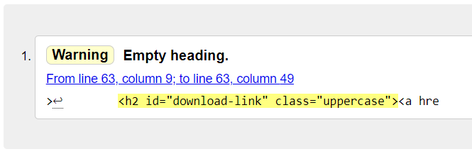
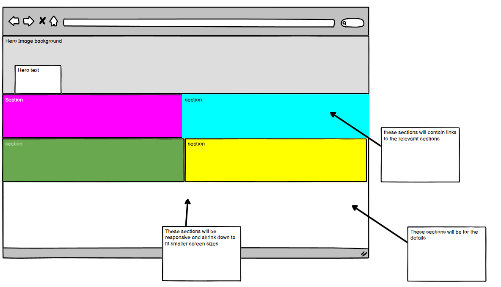
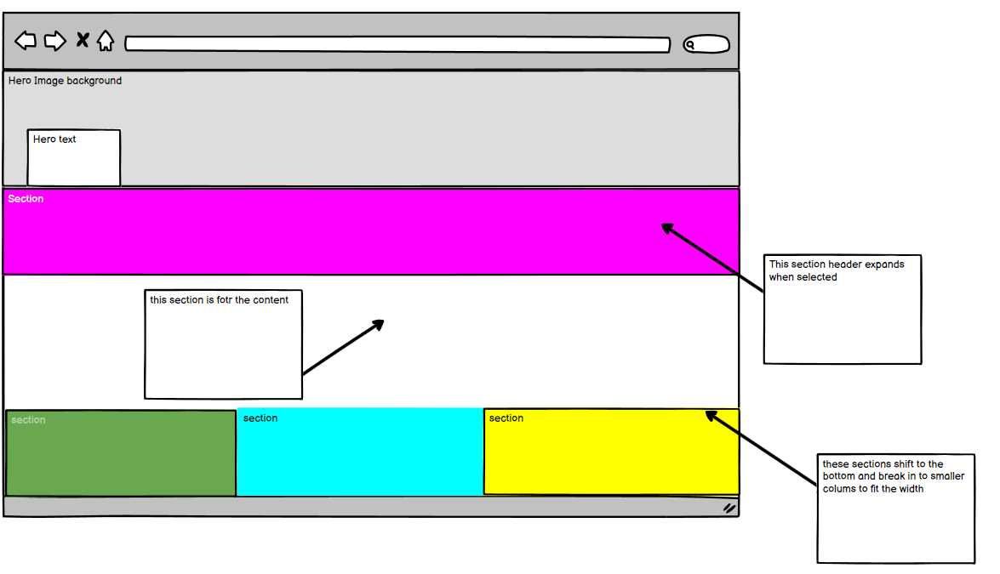

# SafeGuarding project
---

live project here (https://ajswanwick.github.io/safeguarding-ci/)

This project aims to provide guidance and actions in reation to Safeguarding, the Signs that we may come across and 
how and to raise concerns 

---
##Aims
 wanted this website to be easy to navigate, with pastel colors that are warm and clear
 This website was designed to be easy to navigate with large menu bars that have links to the content

 The content appears below the selected header when clicked, 
 this was a fix that was added as previous versions the content would appear beneath all 4 headings, 
 i have tried to make each page a different color which all links in which make the user experience easier as a user would know what page they are currently on. 

 

 this is a screen grab for a mobile, you can see all the headers stack 

wheras in desktop they are in rows

this is an image of the wireframe model i set out you can see i wanted to make 4 clear sections that was very user friendly

this is how i wanted the sections to re-organise after a section is selected 

----
## references 
in building this page i used The Love Running Project and Love rosie project for guidance, the form on thr contact page was used from the love rosie page, 

The content within the pages were taken from various pages including the NHS and NSPCC

There is also a link within this page on the contact form to the nspcc 

This page was built using various techniques, 
the page was styled using flexbox for the main
i used bootstap5 to design the sections 

# Bugs

although the content has been checked and tested there are some small responsive issues on some different screen sizes, for mobile, laptop these seem fine there are some breakpoints that will need to be fixed purely for aesthetics

